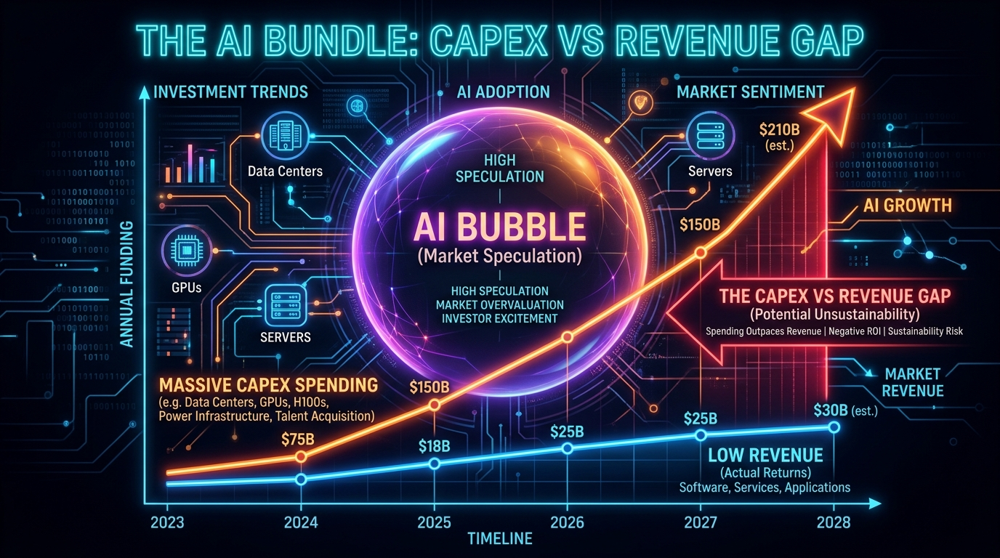
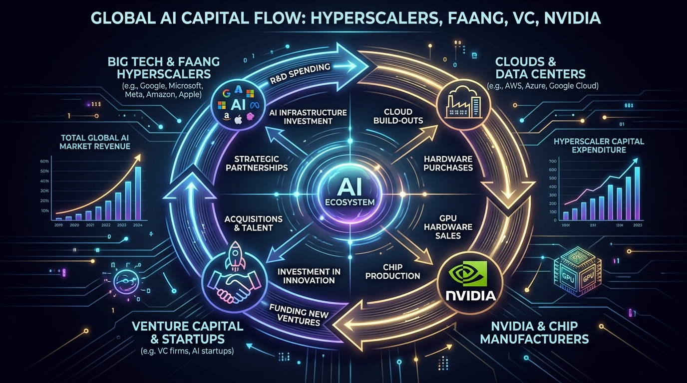

## Data Feminism Principles: When Will AI Be Profitable? {class="scrollable"}

### Auditing Hyperscaler CapEx, Power Dynamics, and the Hidden Labor Behind Generative AI

- **Course**: CS 4083 / CS 5083: Ethical and Responsible AI (Fall 2026)
- **Assignment**: Data Analysis (Week 5 Asynchronous Assignment)
- **Group Authors**: Taylor Wise, Brian Boedecker, Arika Khor (Group 25)
- **Dataset Focus**: Epoch AI (*"When will AI be profitable and how will it be achieved?"*) & [isaiprofitable.com](https://isaiprofitable.com/) Live Tracker

::: {.callout-note}
### Core Objective
Examine how the 7 principles of Data Feminism expose the structural illusions, capital feedback loops, ecological extraction, and shadow labor force powering corporate AI profitability metrics.
:::

---

## The Dataset & The AI Profitability Chasm {class="scrollable"}

### Dataset Overview: Epoch AI & [isaiprofitable.com](https://isaiprofitable.com/)

The dataset tracks corporate AI expenditures, compute cluster investments, annualized revenues (ARR), and estimated operational margins across major tech firms.

::: {.columns}
::: {.column width="33%"}
{width=100%}
**The CapEx Chasm**: Hundreds of billions in GPU infrastructure against modest consumer subscription revenue.
:::

::: {.column width="33%"}
{width=100%}
**Hype-Driven Capital**: VC cash injection chasing speculative market multiples regardless of underlying unit economics.
:::

::: {.column width="33%"}
{width=100%}
**The Closed Loop**: Tech giants investing in startups that immediately recycle funds back into hardware and cloud compute.
:::
:::

---

## Principle #1: Examining Power {class="scrollable"}

> *"Data feminism begins by analyzing how power operates in the world."*

### In Our Own Words
Examining power means mapping who controls data collection, who decides which metrics get prioritized, and whose financial incentives dictate which technical problems receive capital.

### How It Applies to Our Dataset
While this dataset is published by Epoch AI and aggregated from SEC filings, earnings calls, and industry trackers, the power over what data exists is held by institutional venture capital and corporate shareholders. Most tech firms do not build AI because it solves a proven customer need; they are compelled to pivot toward AI to sustain stock valuations and satisfy Wall Street expectations. The data collected reflects what institutional capital wants to measure (run-rate growth and hardware capacity) rather than social utility or operational sustainability.

### Concrete Details & Numbers
- **Allbirds (Footwear to Compute Pivot)**: Allbirds, a company founded on sustainable wool footwear, abruptly pivoted to leasing data center compute capacity. Following this announcement, their stock surged by up to 875% intraday, proving that market capital rewards speculative compute announcements over core operational solvency.
- **Hardware Allocation Hegemony**: Power concentrates in hardware suppliers and hyperscalers. Tier-1 cloud providers lock in multi-year allocations of Nvidia H100 and B200 clusters, forcing early-stage research groups and smaller firms into exploitative cloud pricing or equity concessions just to access compute.

---

## Principle #2: Challenging Power {class="scrollable"}

> *"Data feminism commits to challenging unequal power structures and working toward justice."*

### In Our Own Words
Challenging power means identifying structural asymmetries in the data supply chain, dismantling predatory corporate restructurings, and creating mechanisms for equitable, democratic governance over technological resources.

### How It Applies to Our Dataset
If institutional investors maintain unchecked control over AI infrastructure, technical safety, public utilities, and consumer protection are sacrificed for valuation multiples. With the top 10% of Americans owning roughly 93% of the U.S. stock market, algorithmic priorities and infrastructure footprints are dictated by a tiny wealth bracket. Challenging power requires auditing self-serving corporate restructurings, resisting circular capital tricks, and enacting municipal and state resource guardrails.

### Concrete Details & Numbers
- **OpenAI Non-Profit to For-Profit Structural Capture**: OpenAI was founded as a 501(c)(3) public research non-profit dedicated to safe AI. Leadership subsequently dismantled this structure to convert into a for-profit entity, spending over $16.3B while stripping the original non-profit board's oversight authority to unlock billions in uncapped equity and venture investments.
- **xAI & SpaceX Balance-Sheet Obfuscation**: Elon Musk shifted capital, compute, and engineering staff between SpaceX and xAI. By bundling space launch contracts and private equity vehicles to boost xAI's valuation past $50B, the venture masked operational cash burn from independent audit while soliciting outside capital.
- **Community Resistance & Moratoriums**: In Canadian County and Luther, Oklahoma, local residents organized against hyperscale data center incursions. Citizens packed city halls, forced the resignation of complicit municipal officials, defeated non-disclosure agreements (NDAs), and passed emergency data center moratoria to protect local water wells.

---

## Principle #3: Elevate Emotion and Embodiment {class="scrollable"}

> *"Data feminism teaches us to value multiple forms of knowledge, including the knowledge that comes from people as living, feeling bodies in the world."*

### In Our Own Words
Elevating emotion and embodiment means rejecting the reduction of human lived experience to sanitized corporate spreadsheets, centering the visceral human, bodily, and psychological toll inflicted by capital-driven restructuring.

### How It Applies to Our Dataset
Profitability trackers like Epoch AI and `isaiprofitable.com` focus on upward-trending annualized revenue, GPU counts, and theoretical ROI curves. These sanitized metrics deliberately erase the physical and mental devastation of mass workforce layoffs engineered to fund GPU purchases. Corporate earnings calls celebrate "lean operations" while ignoring the panic, disruption, and livelihood loss experienced by thousands of dismissed employees.

### Concrete Details & Numbers
- **Microsoft Net Income vs. Tech Layoffs**: Microsoft reported a net income of $133B for the fiscal year (up from $101B in the previous period), attributing financial gains to AI cloud integration. Simultaneously, Microsoft executed over 5,500 targeted layoffs across product and engineering divisions, cannibalizing human careers to bankroll billions in hardware CapEx.
- **The Embodied Toll of Algorithmic Layoffs**: Engineers and technical staff face escalating burnout, constant on-call strain, and sudden terminations delivered through cold, automated HR emails. The bodily reality of insomnia, medical insecurity, and psychological trauma never appears in financial models predicting "when AI will become profitable."

---

## Principle #4: Rethink Binaries and Hierarchies {class="scrollable"}

> *"Data feminism requires us to challenge the gender binary, along with other systems of counting and classification that perpetuate oppression."*

### In Our Own Words
Rethinking binaries and hierarchies requires dismantling simplistic either/or categories—such as "profitable vs. unprofitable" or "genuine customer demand vs. speculative cash injection"—to expose self-dealing, circular financial feedback loops.

### How It Applies to Our Dataset
`isaiprofitable.com` demonstrates that the generative AI ecosystem is not a binary division between sustainable profitable businesses and failing startups. Instead, the market is sustained by an insular, circular capital hierarchy where venture firms, hyperscalers, and chipmakers recycle the same capital pools to simulate organic demand and inflate valuations without generating authentic consumer utility.

### Concrete Details & Numbers
- **The Nvidia-CoreWeave Circular Debt Loop**: Nvidia made massive equity investments in GPU cloud provider CoreWeave while backing billions of dollars in CoreWeave's debt. CoreWeave immediately turned around and used those debt-backed funds to purchase tens of thousands of Nvidia H100 GPUs. Nvidia then booked these transactions as historic, record-breaking hardware revenue, pumping its market cap beyond $3 trillion on self-funded hardware sales.
- **Meta Reality Labs Metaverse Capital Sinkhole**: Simplified binary reporting hides colossal capital misallocations behind overall corporate profits. Meta's Reality Labs division accumulated over $88B in operational losses against barely $11.8B in realized revenues (backed by $5.97B in venture and capital injections), masked only by Meta's digital advertising monopoly.

---

## Principle #5: Embrace Pluralism {class="scrollable"}

> *"Data feminism insists that the most complete knowledge comes from synthesizing multiple perspectives, with priority given to local, Indigenous, and experiential ways of knowing."*

### In Our Own Words
Embracing pluralism means insisting that valid knowledge about technological progress cannot originate exclusively from Silicon Valley executive suites and financial analysts. It demands elevating the experiential knowledge of local residents, frontline utility workers, and indigenous land stewards whose environments are depleted by physical infrastructure.

### How It Applies to Our Dataset
Both `isaiprofitable.com` and Epoch AI evaluate AI profitability exclusively through corporate balance sheets, GPU wattages, and software revenues. They omit the externalized physical and communal costs of running hyperscale facilities: depleted municipal aquifers, strained electrical grids, continuous low-frequency noise pollution, and residential rate hikes. By prioritizing corporate accounting over local community survival, the datasets construct a monocultural illusion of progress.

### Concrete Details & Numbers
- **Canadian County & Yukon, Oklahoma Water Crisis**: Beltline Energy proposed a 1 GW data center across 480 acres in Yukon, Oklahoma—an agricultural region enduring severe drought. The project sought up to 2.5 MGD (million gallons per day) of municipal treated wastewater, consuming 100% of Yukon's treatment capacity and leaving zero margin for local farm irrigation or residential growth. Local residents dependent on 15 leased wells in the Garber-Wellington Aquifer faced direct threats of aquifer drawdown with zero developer accountability.
- **Memphis xAI Gas Turbine Pollution**: In Memphis, Tennessee, xAI skirted local air quality permits to install unregistered methane gas combustion turbines to power its "Colossus" supercluster. These turbines spew nitrogen oxides and particulate matter into surrounding working-class, majority-Black neighborhoods, dismissing experiential community health concerns in the rush to train models.

---

## Principle #6: Consider Context {class="scrollable"}

> *"Data feminism asserts that data are not neutral or objective. They are the products of unequal social relations, and this context is essential for conducting accurate, ethical analysis."*

### In Our Own Words
Considering context means auditing the political economy, accounting tricks, and operational conditions behind any numerical metric before accepting it as an objective indicator of success.

### How It Applies to Our Dataset
The metric of "Annualized Revenue" (ARR) is heavily publicized across the dataset to suggest exponential business health. However, ARR is merely a single month or quarter's revenue multiplied by 12, ignoring churn, seasonality, and massive structural expenses. Without context regarding hardware depreciation, thermal cooling costs, electrical utility contracts, and recurring software licensing fees, headline revenue figures conceal massive net losses.

### Concrete Details & Numbers
- **OpenAI 2024 Revenue vs. Compute Chasm**: On December 31, 2024, OpenAI publicized an estimated annualized revenue run-rate of $5.5B. Contextually, its operational compute spend alone in 2024 reached approximately $5.8B—generating an immediate negative operating margin before accounting for thousands of employees, facility leases, data licensing deals, or legal reserves.
- **Hardware Obsolescence & Depreciation Cliffs**: Enterprise H100 GPU clusters experience severe thermal degradation and software obsolescence within 36 to 48 months. Financial models treating current revenue as net profit ignore that the billions spent on compute hardware will need to be spent again before current infrastructure breaks even.

---

## Principle #7: Make Labor Visible {class="scrollable"}

> *"The work of data science, like all work in the world, is the work of many hands. Data feminism makes this labor visible so that it can be recognized and valued."*

### In Our Own Words
Making labor visible means explicitly identifying, enumerating, and valuing the hidden, human labor force that builds, curates, aligns, and physically maintains computational systems.

### How It Applies to Our Dataset
Epoch AI’s "Staff Count" figures track exclusively full-time, salaried corporate personnel while deliberately omitting contract and contingent labor. Corporate narratives celebrate "autonomous artificial intelligence," concealing the millions of human annotators, content moderators, and hardware facility technicians who label datasets, filter toxic violence, and physically maintain server halls.

### Concrete Details & Numbers
- **Google Full AI Division Undercount**: Epoch AI reported a "Staff Count" of 6,000 for Google's AI division on August 6, 2025. This metric completely excludes the global shadow workforce of over 50,000 precarious contractors (employed via intermediary vendors like Appen, Scale AI, and Cognizant) who perform RLHF reinforcement learning, prompt grading, and data cleaning for $2 to $4 an hour without benefits or job security.
- **Physical Data Center Facility Workers**: Hyperscale infrastructure relies on low-wage physical laborers working in 85+ dB acoustic environments: technicians swapping failed liquid-cooling lines, electricians maintaining backup generator arrays, and facility janitors—workers completely erased from "AI talent" indices.

---

## Slide 8: Generative AI Comparison & Adversarial Audit {class="scrollable"}

### Methodology & Adversarial Audit Framework
After drafting the initial seven principle analyses directly without generative AI assistance, we subjected our findings to an adversarial red-team audit using a multi-agent AI system:
- **Primary Orchestrator**: Gemini 3.8 Flash (High Reasoning mode) for syntactic stress-testing and baseline synthesis.
- **Adversarial Verification Gate**: Hermes & Jev protocol engine enforcing anti-sycophancy and empirical cross-checks.
- **Swarm Fact-Checking Sentinels**: GSD subagents querying SEC 10-K filings, municipal records, and engineering memos, synchronized via local SQLite state.

### Comparative Audit: Human Analysis vs. Generative AI Baseline

| Dimension | Human Empirical Analysis (Slides 1–7) | Generative AI Baseline Response |
| :--- | :--- | :--- |
| **Mechanisms vs. Platitudes** | Grounded in hard balance-sheet events: Allbirds 875% pivot, Nvidia-CoreWeave debt circularity, Garver effluent records. | Defaulted to generic corporate ethics slogans (*"stakeholder alignment"*, *"inclusive algorithms"*, *"equitable AI policies"*). |
| **Financial Accounting** | Dissected the ARR trap: isolated $5.8B compute spend against $5.5B ARR; highlighted 3-year GPU depreciation cliffs. | Conflated Annualized Run-Rate with net operational profit, uncritically celebrating headline top-line growth. |
| **Material Ecology** | Expanded pluralism to physical municipal utility capture (2.5 MGD in Yukon, unregistered gas turbines in Memphis). | Confined "pluralism" and "context" narrowly to linguistic and token diversity in training corpora. |
| **Labor Visibility** | Exposed the 50,000+ outsourced RLHF contractor workforce and server hall maintenance technicians. | Highlighted high-status AI research scientists, erasing the global clickworker underclass that aligns models. |
